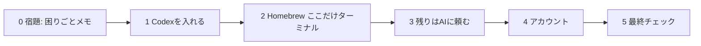

# 事前準備（10月6日までにやること）

当日は朝から自社のダッシュボードを作り始めます。インストールとアカウント作成は、この準備で済ませてきてください。所要1〜2時間。**詰まったらAIに聞きながら進めてOK**です。

講義サイトの画面つき版: https://aigassyuku07.vercel.app/prep



## 0. 宿題: 困りごとをメモする（いちばん大事）

当日、AIがあなたの業務について質問します（`grill-with-docs`）。材料が多いほど、作るものが良くなります。

**(a) 困りごとを1つ以上**

> 誰が、何に困っていて、何が見えると嬉しいか

例: 案件の進捗が誰にも見えず、毎朝口頭で確認している

**(b) いま使っている帳票の「項目名」**

スプレッドシートや紙の見出しを、そのまま書き写してきてください（中身は不要）。

> 例: 顧客名 / 担当 / 受付日 / 見積金額 / 状況 / 次アクション

うまく書けない人は、ChatGPTやClaudeに次を貼ると、AIが質問しながら引き出してくれます。

```text
私の仕事の困りごとを言語化したいです。業務で「面倒なこと」「誰にも見えていないこと」
「毎回確認していること」を一緒に掘り下げてください。
質問は番号付きでまとめて出し、それぞれに推奨回答を添えてください。
```

**個人情報や実データは持ち込まないでください。** 画面はダミーデータで作ります。

## 1. Codexを入れてサインインする（10分）

https://openai.com/codex/ からCodexアプリを入れ、会社のChatGPTアカウントでサインインします。Claudeを使う人は https://claude.ai/download も入れてください。入れたら、Codexで**書類（Documents）フォルダ**を作業フォルダとして開いておきます。

## 2. Homebrewを入れる（Mac・10分。ここだけターミナル）

パスワード入力が要るので、ここだけはターミナル（`アプリケーション` → `ユーティリティ` → `ターミナル`）に貼ります。最後に出る「Next steps」の2行も実行します。Windowsの人は不要です。

```bash
/bin/bash -c "$(curl -fsSL https://raw.githubusercontent.com/Homebrew/install/HEAD/install.sh)"
```

## 3. 残りの道具とキットは、AIに頼む（10分）

Codexに次を貼ります。

```text
AI合宿の事前準備をしています。次を順番にやってください。コマンドはあなたが実行してください。
1. Node.js（20以上）、git、GitHub CLI（gh）が入っているか確認し、無ければ入れる（MacはHomebrew、Windowsはwinget）
2. このフォルダに https://github.com/sento-group-inc/Aigassyuku07 をcloneする
3. Aigassyuku07/kit フォルダで ./setup.sh を実行し、結果を初心者にも分かる言葉で説明する
NG が出たら、直し方を1つずつ教えてください。
```

## 4. アカウントを作る（15分）

| サービス | 何に使うか | やること |
|---|---|---|
| GitHub | コードの置き場 | https://github.com/signup で作成 |
| Vercel | 本番URLで公開する | https://vercel.com/signup で **Continue with GitHub** |
| Supabase | データベースとログイン | https://supabase.com/dashboard/sign-in で **Continue with GitHub** |

**クレジットカードは不要です。** 無料枠の範囲で作ります。会社で使うので、個人ではなく会社のメールで作るのがおすすめです。

最後に、手元のPCからGitHubを使えるようにします（ブラウザでの確認があるので、ここもターミナル）。`GitHub.com` → `HTTPS` → `Login with a web browser` の順に答えます。

```bash
gh auth login
```

## 5. 最終チェック

Codexに次を貼ります。

```text
Aigassyuku07/kit フォルダで ./setup.sh と ./setup.sh --check-services を実行して、
全部OKかどうかを教えてください。NG があれば直し方も教えてください。
```

- [ ] 困りごとメモと帳票の項目名がある
- [ ] AIの答えが「要対応: 0」で、GitHubが「サインイン済み」
- [ ] Codexを開いてチャットできる
- [ ] Vercel と Supabase にGitHubでサインインできる

## うまくいかないとき

| 症状 | 対処 |
|---|---|
| Homebrewのあとに `brew` が見つからない | 「Next steps」の2行を実行し忘れている。ターミナルを開き直して、その2行を貼る |
| AIが「権限がない」と言う | Codexの画面に出る「許可」ボタンを押す |
| 会社のPCで管理者権限がない | 情報システム担当に「Homebrew・Node.js・git・GitHub CLI・Codexを入れたい」と事前に依頼してください。間に合わなければ事前に講師へ連絡を |

詰まったら、次をAIに貼ってください。

```text
MacでAI合宿の事前準備をしています。
やりたいこと: Node.js / git / GitHub CLI / Codex を使える状態にしたい
実行したコマンド: [ここに貼る]
出たエラー: [ここに貼る]
初心者にもわかるように、次に確認することと、実行するコマンドを1つずつ教えてください。
```

**解決しなくても大丈夫です。** 当日の10:00〜の時間で拾います。
