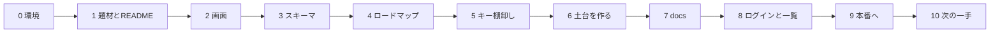

# 当日の進行台本

ガイド（`guide`スキル）はこのファイルを読み、**チェックの付いていない最初のステップ**を次の一手として案内する。

各ステップは「終わりの状態」を満たしたらチェックする（`[ ]` を `[x]` にする）。満たせていないのに次へ進まない。

Step 0〜5 はこの `kit/` フォルダで進める。Step 6 で自分のアプリ（`my-dashboard`）を作り、Step 6 以降はそちらで進める（このファイルもコピーされる）。

---

## [ ] Step 0. 環境を確かめる

- 目的: 今日使う道具が揃っているかを先に確かめる。あとで詰まると流れが止まる
- 使うスキル: `guide`
- やること: `./setup.sh` と `./setup.sh --check-services` を実行し、`NG` を埋める
- 終わりの状態: `./setup.sh` の最後が `要対応: 0`。`--check-services` に `NG` が無い

## [ ] Step 1. 題材を決めて、READMEを書く

- 目的: 何を作るかを、業務の困りごとから決め、言葉にして残す
- 使うスキル: `grill-with-docs`
- やること: AIの質問に答えて、困りごとを1つに絞る。答えを `README.md` と `CONTEXT.md` に書いてもらう
- 終わりの状態: `README.md` の冒頭に次の1文があり、`CONTEXT.md` に業務の言葉が3つ以上ある

  > 〈誰〉が〈何〉に困っている。〈何〉が見えるようになると嬉しい。

## [ ] Step 2. 画面を作る

- 目的: 言葉を、見える画面にする
- 使うスキル: `dashboard-screen`
- やること: 必要な画面を3枚以内で作る（一覧・詳細・入力）。まず見た目と操作を固める
- 終わりの状態: `docs/prototype.html` があり、ブラウザで開いて操作できる

## [ ] Step 3. スキーマとER図を作る

- 目的: 画面の裏にあるデータの形を決める
- 使うスキル: `dashboard-schema`
- やること: テーブル・項目・つながりを出し、**ER図にして漏れを確認する**
- 終わりの状態: `docs/schema.md` にテーブル一覧とER図があり、**「この情報はどこに入るか」に全部答えられる**

## [ ] Step 4. ロードマップを書く

- 目的: 実装を、確認できる単位（スライス）に切る
- 使うスキル: `dashboard-roadmap`
- やること: スライスに分け、**手前で価値が出る順**に並べる。**S1は「ログインして一覧が見える」に固定**
- 終わりの状態: `docs/roadmap.md` に番号付きのスライスがあり、S1が今日中に終わる大きさ

## [ ] Step 5. キーとアカウントを棚卸しする

- 目的: 外部とつなぐために何が要るかを先に知る
- 使うスキル: `dashboard-keys`
- やること: 必要なサービスとキーの**置き場所**を決める
- 終わりの状態: `docs/keys.md` に表があり、値はどこにも書かれていない

## [ ] Step 6. 土台を作る（DB・アプリ・リポジトリ）

- 目的: データの倉庫とアプリの箱を作り、手元で開く
- 使うスキル: `dashboard-repo`
- やること: Supabaseでプロジェクトを作る → with-supabaseテンプレートでアプリを作る → キットの中身をコピー → `.env.local` → GitHubへ
- 終わりの状態: http://localhost:3000 で画面が開き、GitHubにリポジトリがある

## [ ] Step 7. docsとAGENTS.md / CLAUDE.mdを整える

- 目的: AIが毎回同じ前提で作業できるようにする
- 使うスキル: `dashboard-docs`
- やること: スキーマの**背景**、UIガイドライン、インフラ、ロードマップを埋める
- 終わりの状態: `AGENTS.md` の「作業前に読む」から全部たどれる。空欄が残っていない（「未確定」は可）

## [ ] Step 8. ログインと一覧を作る（S1）

- 目的: 社員だけがログインでき、ログインすると一覧が見える
- 使うスキル: `dashboard-auth`（作り方）→ `dashboard-slice`（PR→マージ）
- やること: 勝手な登録を止める → 社員アカウントを作る → テーブルとダミーデータ → 一覧画面 → 確かめる → PR → マージ
- 終わりの状態: ログインしないと一覧が見えず、ログインするとダミーデータの一覧が見える。PRがマージされている

## [ ] Step 9. 本番へ出す

- 目的: 自分のURLで開けるようにする
- 使うスキル: `dashboard-deploy`
- やること: Vercelにつなぐ → 環境変数 → Deploy → SupabaseのURL設定
- 終わりの状態: **本番URLを開き、ログインして一覧が動く**

## [ ] Step 10. 次の一手を決めて、振り返る

- 目的: 明日以降、自分で進められるようにする
- 使うスキル: `guide` → `reflect`
- やること: 残りのスライスから次を1つ選び、`docs/roadmap.md` に印を付ける。今日の学びを `reflect` で残す
- 終わりの状態: 「明日はこれをやる」が1行で書かれ、学びが1つ以上ファイルに残っている

---

## ガイドの判定ルール

上から見て、**チェックが付いていない最初のステップ**を次の一手とする。ただし次に当てはまるときは判定を変える。

| 状況 | 判定 |
|---|---|
| 前のステップの成果物が無い | そのステップへ戻す（例: `docs/schema.md` が雛形のままならStep 3へ） |
| 成果物はあるが中身が空 | 埋める作業を指示する |
| 同じ場所で2回詰まった | スコープを半分に割る。**半分にした方を先に終わらせる** |
| 時間が押している | Step 9（本番）→ Step 4（ロードマップ）→ Step 3（スキーマ）の順で優先する |
| 開発の進め方そのものに迷っている | `poteto-mode` で現在地と次の一手を出す |
