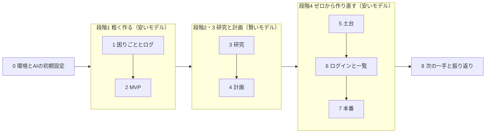

# 当日の進行台本

ガイド（`guide`スキル）はこのファイルを読み、**チェックの付いていない最初のステップ**を次の一手として案内する。

各ステップは「終わりの状態」を満たしたらチェックする（`[ ]` を `[x]` にする）。満たせていないのに次へ進まない。

## 全体の流れ（4つの段階）

## この流れを支える前提（毎回守る）

- **ログに書きながら進める。** 要望・気づき・決定・詰まりは、出たその場で `docs/log.md` に書く（`dev-log`）。AIの記憶と会話は、モデルやセッションを替えると消えるため。
- **モデルを替える前に、ファイルへ書く。** 段階が変わるとモデルを替える。次のモデルに渡るのはファイル（`docs/log.md`、`mvp/`、`docs/research.md`、計画のdocs）だけ。
- **MVPは捨てる。** 段階4ではMVPのコードを流用せず、計画だけを見てゼロから作る。だから段階1は雑でいい。
- **使うモデルは段階で決まる。** 作る・作り直すは安いモデル、研究・計画はいちばん賢いモデル（`ai-setup`）。

Step 0〜4 はこの `kit/` フォルダで進める。Step 5 で自分のアプリ（`my-dashboard`）を作り、Step 5 以降はそちらで進める（このファイルもログもコピーされる）。

---

## [ ] Step 0. 環境とAIの初期設定をそろえる

- 目的: 道具が揃っているかと、段階ごとに使うモデルを先に確かめる
- 使うスキル: `guide` → `ai-setup`
- モデル: どれでもよい
- やること: `./setup.sh` と `./setup.sh --check-services` を実行して `NG` を埋める。`ai-setup` で段階ごとのモデルの切り替え方を確認する
- 終わりの状態: `./setup.sh` の最後が `要対応: 0`。`--check-services` に `NG` が無い。段階1で使うモデルに切り替えてある

## 段階1 粗く作る（安いモデル: Codex は Luna / Sol、Claude は Sonnet）

## [ ] Step 1. 困りごとを1文にして、ログを始める

- 目的: 何を作るかを1文にし、以降の声を全部ためる入れ物を作る
- 使うスキル: `dev-log`
- やること: 困りごとを1文にして `docs/log.md` の最初に書く。事前準備のメモ（帳票の項目名など）も貼る
- 終わりの状態: `docs/log.md` に次の1文と、帳票の項目名がある

  > 〈誰〉が〈何〉に困っている。〈何〉が見えるようになると嬉しい。

## [ ] Step 2. MVPを作って触る

- 目的: 触れるものを最速で作り、触って出た声をログにためる
- 使うスキル: `dashboard-mvp` / `dev-log`
- やること: 安いモデルで `mvp/index.html` を作る → ブラウザで触る → 出た声をログへ → 2〜3回小さく直す
- 終わりの状態: `mvp/index.html` を自分で操作でき、`docs/log.md` に要望・気づきが5つ以上ある

## 段階2・3 研究と計画（いちばん賢いモデル: Codex は Astra、Claude は Opus）

**ここでモデルを切り替える。** 切り替える前に「ここまでをログに書いて」と頼む。

## [ ] Step 3. 研究する

- 目的: MVPのあらゆる品質を上げる方法を調べ、洗練された前提をファイルに作る
- 使うスキル: `dashboard-research`（ユーザーへの質問は `grill-with-docs` の型）
- やること: MVPとログを見せ、6つの観点（使う人・画面と操作・データの形・権限と安全・運用・範囲）で研究させる。番号付きの質問に「1はA、2は推奨でOK」のように答える
- 終わりの状態: `docs/research.md` に6つの観点の結論があり、`README.md` に困りごとと使う人、`CONTEXT.md` に業務の言葉が3つ以上ある

## [ ] Step 4. ブラッシュアップ計画を作る

- 目的: 安いモデルが計画だけを見てゼロから作り直せる「図面一式」を作る
- 使うスキル: `dashboard-plan`（中で `dashboard-schema` → `dashboard-roadmap` → `dashboard-keys` → `dashboard-docs` を使う）
- やること: スキーマとER図、ロードマップ（**S1は「ログインして一覧が見える」**）、キーの置き場所、画面の原則、AIへの指示を書く
- 終わりの状態: `docs/schema.md` `docs/roadmap.md` `docs/keys.md` `docs/ui-guidelines.md` `AGENTS.md` が埋まり、ログの要望が全部どれかのスライスに入っているか「やらない（理由）」になっている

## 段階4 ゼロから作り直す（安いモデルに戻す）

**ここでモデルを安いモデルに戻す。** MVPのコードは使わず、計画のファイルだけを見て作る。

## [ ] Step 5. 土台を作る（DB・アプリ・リポジトリ）

- 目的: データの倉庫とログイン画面つきのアプリの箱を作り、手元で開く
- 使うスキル: `dashboard-repo`
- やること: Supabaseでプロジェクトを作る → with-supabaseテンプレートでアプリを作る → キットの中身（計画・ログ・スキル）をコピー → `.env.local` → GitHubへ
- 終わりの状態: http://localhost:3000 で画面が開き、GitHubにリポジトリがある

## [ ] Step 6. ログインと一覧を作る（S1）

- 目的: 社員だけがログインでき、ログインすると一覧が見える
- 使うスキル: `dashboard-auth`（作り方）→ `dashboard-slice`（PR→マージ）
- やること: 勝手な登録を止める → 社員アカウントを作る → テーブルとダミーデータ → 一覧画面 → 確かめる → PR → マージ
- 終わりの状態: ログインしないと一覧が見えず、ログインするとダミーデータの一覧が見える。PRがマージされている

## [ ] Step 7. 本番へ出す

- 目的: 自分のURLで開けるようにする
- 使うスキル: `dashboard-deploy`
- やること: Vercelにつなぐ → 環境変数 → Deploy → SupabaseのURL設定
- 終わりの状態: **本番URLを開き、ログインして一覧が動く**

## [ ] Step 8. 次の一手を決めて、振り返る

- 目的: 明日以降、自分で進められるようにする
- 使うスキル: `guide` → `reflect`
- やること: ログの要望と計画を照らして、満たせていないものを確認する。残りのスライスから次を1つ選び、`docs/roadmap.md` に印を付ける。今日の学びを `reflect` で残す
- 終わりの状態: 「明日はこれをやる」が1行で書かれ、学びが1つ以上ファイルに残っている

---

## ガイドの判定ルール

上から見て、**チェックが付いていない最初のステップ**を次の一手とする。ただし次に当てはまるときは判定を変える。

| 状況 | 判定 |
|---|---|
| 前のステップの成果物が無い | そのステップへ戻す（例: `docs/research.md` が無いのに計画しようとしている → Step 3へ） |
| 段階が変わるのに、ログへの書き出しが済んでいない | 先に「ここまでをログに書く」を指示し、そのあとモデルの切り替えを案内する |
| 段階と使っているモデルが合っていない | `ai-setup` の表でモデルの切り替えを案内する |
| 同じ場所で2回詰まった | スコープを半分に割る。**半分にした方を先に終わらせる** |
| 時間が押している | Step 7（本番）→ Step 4（計画）→ Step 3（研究）の順で優先する |
| 開発の進め方そのものに迷っている | `poteto-mode` で現在地と次の一手を出す |
