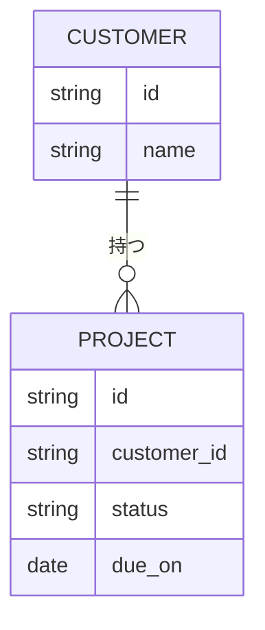

# データスキーマ

> これは雛形。Step 4（計画）でAIと一緒に埋める。**このドキュメントがデータの正本**になる。

## 書き方

1. 画面に出ている情報を全部書き出す（1行1項目）
2. 同じものをまとめてテーブルにする
3. どの項目がどの項目と繋がるかを線で結ぶ（ER図）
4. **迷った決定は「なぜそうしたか」をここに残す**（あとで自分が読み返す）

## テーブル一覧

| テーブル | 何を表すか | 主な項目 |
|---|---|---|
| （例）顧客 | 取引先 | 名前、担当、連絡先 |
| （例）案件 | 進行中の仕事 | 顧客、状態、期限 |

## ER図

## 決定の記録

**なぜその形にしたかを残す。** ER図を見て出た指摘・迷った点・後で変えた点はここへ追記する。

| 日付 | 決めたこと | なぜ | 代わりに捨てた案 |
|---|---|---|---|
| | | | |

## 未確定

- [ ] （例）案件に担当を複数つけられるようにするか
